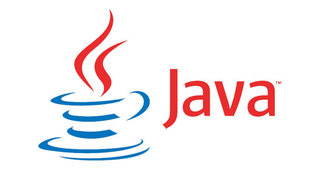

---
> # JAVA란?

이곳은 ~~JAVA에 대한 설명을~~ *저의 프로젝트에 활용된 언어에 대한 설명을* 작성합니다.

~~이 문서는~~ **마크다운 문법**을 사용합니다.

> ## JAVA에 대해서
> 1. JAVA는 제임스 고슬링이 1995년에 만들었습니다.
> 2. JAVA는 객체지향언어입니다.
> 3. 캡슐화, 다형성, 상속을 핵심 요소로 가지고 있습니다.

* JDK로 vs code를 사용하여 프로젝트를 진행하였습니다.
+ 프로젝트는 협업을 통한 오목 프로그램의 구현을 목적으로 합니다.
- 팀장: 배승재 <http://github.com/bsjjay20060u14-debug>
****

```
System.out.print("hello JAVA");
```
